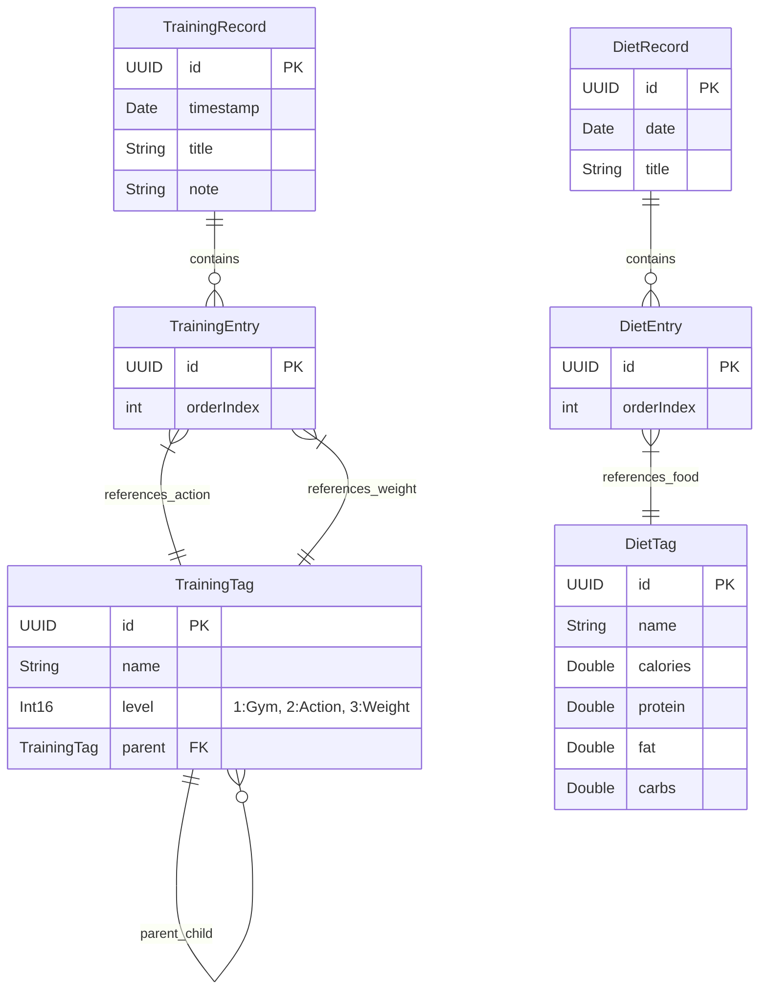

# Technical Architecture Document - MuscleMetric

## 1. Architecture Design

MuscleMetric 采用基于 iOS 原生的**本地优先 (Local-First)** 架构。应用不依赖传统的后端 API 服务，而是直接利用 Apple 提供的 **CloudKit** 进行数据的云端存储与多设备同步。Core Data 作为本地持久化层，通过 `NSPersistentCloudKitContainer` 与 CloudKit 无缝集成。

```mermaid
graph TD
  A[iOS App (SwiftUI)] --> B[Core Data Context]
  B --> C[NSPersistentCloudKitContainer]
  C -->|自动同步| D[iCloud / CloudKit Database]

  subgraph "Client Layer (iOS)"
      A
      B
      C
  end

  subgraph "Cloud Layer (Apple)"
      D
  end
```

## 2. Technology Description

*   **Language**: Swift 5+
*   **UI Framework**: SwiftUI (声明式 UI，响应式布局)
*   **Data Persistence**: Core Data (本地数据库)
*   **Cloud Sync**: CloudKit (通过 `NSPersistentCloudKitContainer` 自动镜像 Core Data 数据)
*   **Deployment Target**: iOS 16.0+ (确保支持较新的 SwiftUI 特性)

## 3. Route Definitions

由于是原生 iOS 应用，使用 SwiftUI 的 `NavigationStack` 或 `TabView` 进行页面管理。

| View/Route | Purpose |
|------------|---------|
| `ContentView` (Root) | 根视图，包含 TabView 导航。 |
| `HomeView` | 首页，展示入口及概览。 |
| `StrengthRecordView` | 力训记录创建与编辑页面。 |
| `DietRecordView` | 饮食记录创建与编辑页面。 |
| `TagManagerView` | 标签管理入口，包含力训和饮食标签的增删改查。 |
| `StrengthTagListView` | 力训标签层级浏览与选择视图。 |
| `DietTagListView` | 饮食标签列表选择视图。 |

## 4. Data Model

应用使用 Core Data 模型 (`.xcdatamodeld`) 定义实体。

### 4.1 Data Model Definition



### 4.2 Entity Descriptions

1.  **TrainingTag (力训标签)**
    *   `id`: UUID
    *   `name`: String (标签名称)
    *   `level`: Integer (1=门店, 2=动作/器械, 3=重量)
    *   `parent`: Relationship (To TrainingTag, Inverse: children) - 实现多级标签结构。
    *   `children`: Relationship (To TrainingTag, Inverse: parent)

2.  **TrainingRecord (力训记录)**
    *   `id`: UUID
    *   `timestamp`: Date (记录时间)
    *   `title`: String (自定义标题)
    *   `entries`: Relationship (To TrainingEntry, One-to-Many) - 包含具体的训练项。
    *   `gymTag`: Relationship (To TrainingTag, Optional) - 关联的一级标签（门店），用于锁定上下文。

3.  **TrainingEntry (力训条目)**
    *   `id`: UUID
    *   `actionTag`: Relationship (To TrainingTag) - 关联的二级标签。
    *   `weightTag`: Relationship (To TrainingTag) - 关联的三级标签。
    *   `record`: Relationship (To TrainingRecord) - 所属记录。

4.  **DietTag (饮食标签)**
    *   `id`: UUID
    *   `name`: String
    *   `calories`: Double (总热量)
    *   `protein`: Double (蛋白质)
    *   `fat`: Double (脂肪)
    *   `carbs`: Double (碳水)

5.  **DietRecord (饮食记录)**
    *   `id`: UUID
    *   `date`: Date (记录日期，通常只精确到天)
    *   `title`: String (默认为日期)
    *   `entries`: Relationship (To DietEntry, One-to-Many)

6.  **DietEntry (饮食条目)**
    *   `id`: UUID
    *   `foodTag`: Relationship (To DietTag)
    *   `record`: Relationship (To DietRecord)
    *   *(可选: quantity/servingSize 用于倍数计算，需求未明确提及，暂按引用标签原始值处理)*

## 5. Security & Permissions

*   **iCloud Authentication**: 应用依赖系统级 iCloud 登录，无需在应用内处理密码或 Token。
*   **Data Privacy**: 数据存储在用户私有的 iCloud 容器中，开发者无法直接访问用户数据。
*   **CloudKit Permissions**: 首次启动时需要向用户请求网络及 iCloud 访问权限（通常由系统自动处理）。
